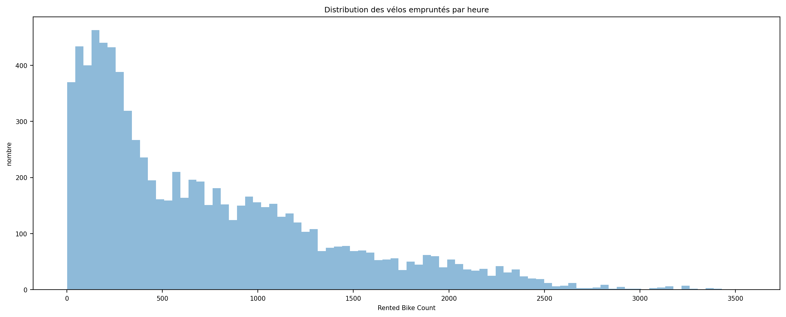
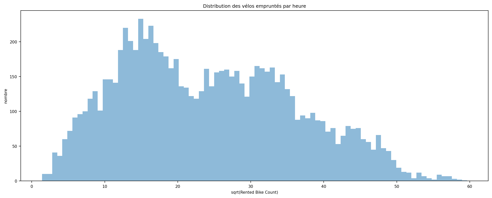
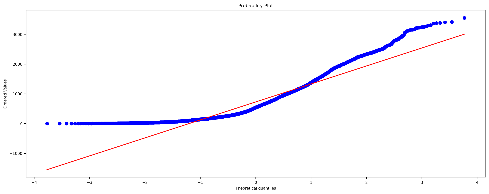
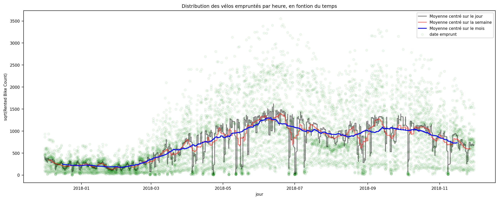
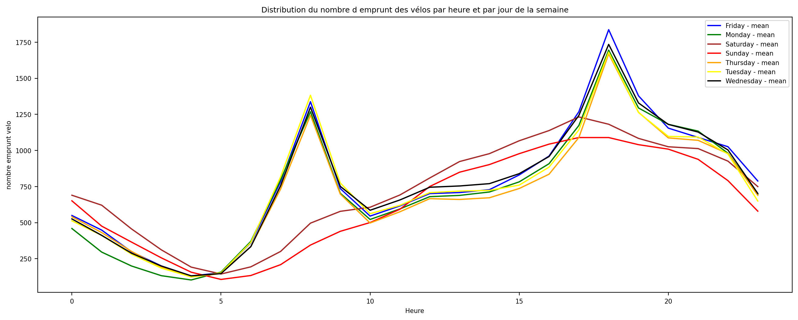
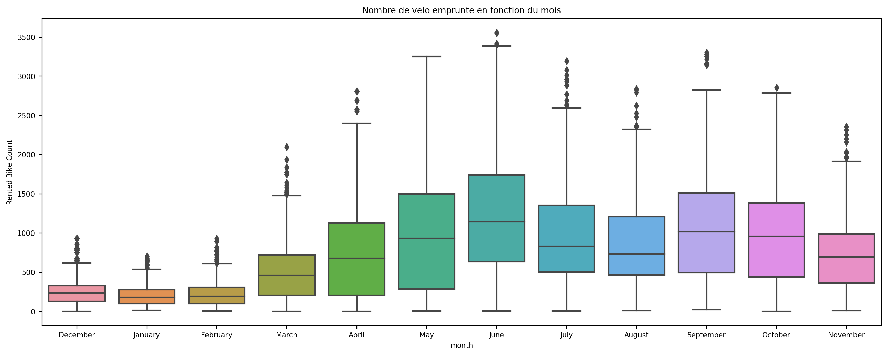
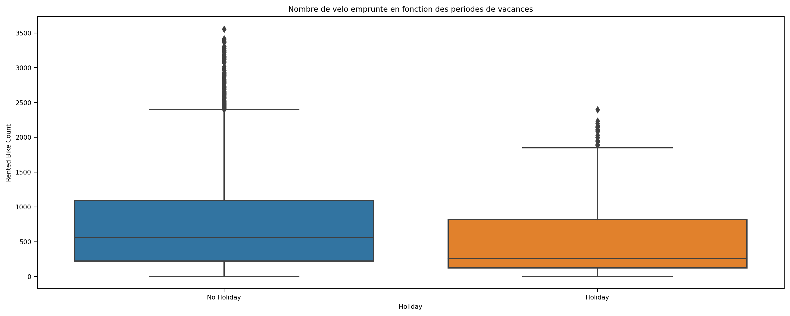
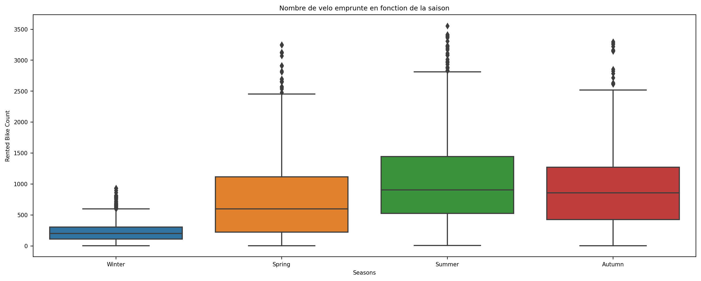
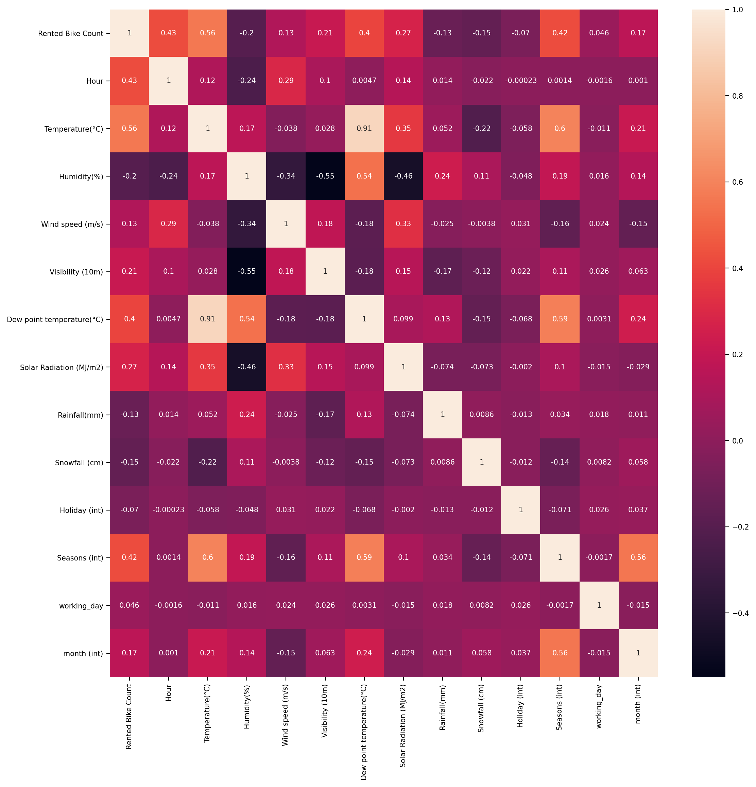

# python-project

Projet final en Python for Data Analyst

## Dataset

Mon dataset : <https://archive.ics.uci.edu/ml/datasets/Seoul+Bike+Sharing+Demand>

Avec l'introduction des vélos à loué en ville qui ont permis l'amélioration de la mobilité, on cherche à savoir/prédire le nombre de vélo qui doivent être disponible à toute heure de la journée.

Le dataset contient ces informations :

| Donnée                | Type                                                |
| --------------------- | --------------------------------------------------- |
| Date                  | year-month-day                                      |
| Rented Bike count     | Count of bikes rented at each hour                  |
| Hour                  | Hour                                                |
| Temperature           | Celsius                                             |
| Humidity              | %                                                   |
| Windspeed             | m/s                                                 |
| Visibility            | 10m                                                 |
| Dew point temperature | Celsius                                             |
| Solar radiation       | MJ/m2                                               |
| Rainfall              | mm                                                  |
| Snowfall              | cm                                                  |
| Seasons               | Winter, Spring, Summer, Autumn                      |
| Holiday               | Holiday/No holiday                                  |
| Functional Day        | NoFunc(Non Functional Hours), Fun(Functional hours) |

Le fichier csv original n'est pas en encoding utf-8, j'ai donc du d'abord changer l'encoding du fichier en utf-8 pour ensuite pouvoir l'utiliser.

Les changements sur les données qualitatif en quantitatif pour le machine learning sont :

| Donnée         | Type                                           |
| -------------- | ---------------------------------------------- |
| Seasons        | Winter = 1, Spring = 2, Summer = 3, Autumn = 4 |
| Holiday        | No Holiday = 0, Holiday = 1                    |
| Functional Day | No = 0, Yes = 1                                |

La valeur dont nous avons besoin de prédire est "Rented Bike count", le nombre de vélos loués à Séoul à chaque heure de la journée.

L'objectif est d'avoir : 

1- un PowerPoint au format PDF contenant la démarche et les résultats de notre analyse et de nos modèles.

2- Deux fichier Jupyter Python contenant le code de data visualisation et de modeling

3- Une API Django

#
## Data Visualisation

Le dataset ne contient pas de data nulle. Cela facilite le traitement.
Toutefois, la variable Functioning day implique que la station est fermé et que, du coup, le nombre de location de velo est nul. Nous allons donc supprimer toutes les lignes correspondante afin d'améliorer notre dataset.

On applique une fonction sqrt() sur le nombre de velo afin d'obrenir une pseudo gaussienne

Nous pouvons voir que le nombre de vélo loué varie énormément en fonction du mois / saison de l'année. Examinons cela plus en détail.

Nous pouvons voir qu'il y a une différence importante de distribution de location des velos en fonction de l'heure et si nous sommes en semaine ou week-end. Nous allons donc créer une variable working_day pour cela.

Nous voyons bien la différence en fonction du mois. Nous allons créer une variable numérique mois (de 1 a 12).

Il y a une petite difference en fonction de si l'on est en vacances ou non. Nous allons donc passer Holiday en variable quantitative.

De même, la saison a un effet important et allons créer une variable quantitative dessus à la place du nom en dur.

La matrice de correlation nous donne comme information la confirmation de l'importance de certaines variables.

#
##